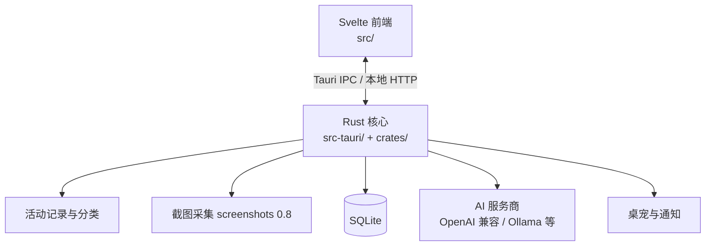
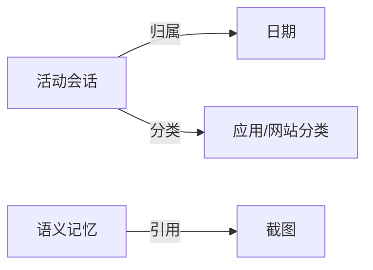

# PROJECTWIKI.md

> 基础版知识库（2026-08-18 创建）。当前以"骨架 + 已知信息"为原则建立，各章节标注待补全项，后续随代码变更增量更新，避免整篇重写。

## 1. 项目概述

- **目标**：Work-Review——自动记录电脑工作活动（应用/网站/截图），生成工作日报与统计，辅以 AI 助手、语义记忆与桌宠通知。
- **背景**：面向个人工作复盘与效率管理，支持 Windows / macOS / Linux。
- **范围**：活动记录与分类、AI 日报/助手、桌宠通知、多语言界面（简中/繁中/英/阿文）。
- **技术栈**：Tauri 2.10（Rust 核心）+ Svelte/Vite/Tailwind 前端 + TypeScript 工具链（Node 22+），数据存 SQLite。
- **运行环境**：桌面端；macOS 需辅助功能/输入监控授权，Windows 涉及 UIA 探测与 Defender 智能控制说明。

## 2. 架构设计

- 关键路径：活动记录 → 分类（内置知识库 + AI 学习）→ 统计/日报 → AI 助手与记忆检索。
- 前端入口 `src/`，Rust 入口 `src-tauri/` 与 `crates/`（workspace），构建产物经 `dist/`。

## 3. 架构决策记录（ADR）

- 目录：`docs/adr/`（待建立；当前以本节条目形式记录）
- **ADR-20260818-01｜RustSec 审计降噪策略**：`cargo audit` 仅对**漏洞与 unsound 类**公告建 Issue 跟踪；unmaintained 类（gtk-rs GTK3、unic-\*、paste、proc-macro-error、fxhash、rustls-pemfile，共 19 条）加入 `security-audit.yml` 的 `ignore`。理由：unmaintained 为信息性提示、无 patched 版本、多数源于 Tauri 2 Linux 依赖树，无法通过升级消除。影响：审计 Issue 信噪比提升；待 Tauri 3 / GTK4 迁移时可重估。2026-08-20 追加：应作者要求移除每周定时触发（ADR-20260820-01），改为锁文件变更触发 + 手动运行。
- **ADR-20260818-02｜AI 服务商配置缓存**：`AppConfig` 新增 `text_model_provider_cache: HashMap<String, ModelConfig>`（key 为 provider id），前端 `SettingsAI` 切换服务商时把当前配置快照写入该缓存并随保存落盘，初始化时载入。理由：原实现仅组件内存缓存（`providerConfigs`），切标签页/重启即丢，且后端 `text_model` 单值字段保存新服务商时覆盖旧 Key。兼容性：`#[serde(default)]`，旧配置文件可正常加载。测试：`src/routes/settings/ProviderKeyMemory.test.ts`。
- **ADR-20260819-01｜思考型模型兼容**：DeepSeek V4/R1、Qwen3 等"对话+思考"混合模型的思维链走 `reasoning_content` 字段（与 `content` 同级）。此前应用完全不解析该字段，且助手链路 `max_tokens=1600` 会被思考耗尽导致"连接测试成功但助手无回复"（测试仅校验 HTTP 200）。决策：① 流式装配器与非流式解析均支持 `reasoning_content`（思考帧实时输出、空正文兜底思维链）；② OpenAI 兼容链路默认 `max_tokens` 8192（Claude 默认 1600，均可被 `max_output_tokens` 覆盖）；③ 连接测试校验非空输出（content 或 reasoning_content），探测额度 16→256。显式思考开关见 ADR-20260822-01。测试：`src/ReasoningModelCompat.test.ts` + `crates/core/src/generation_params.rs` 单测。
- **ADR-20260822-01｜助手超时与思考开关**：不合并 PR #142，在主干自实现。超时：`assistant_timeout_secs`（默认 120，30–900）作为一次助手请求的**单一绝对 deadline**，响应头、流式空闲、429 重试、确认等待、收束共用剩余预算；前端超时额外 +2s 并调用 `cancel_assistant_request`。收束从总预算预留 5–15 秒。日报：`report_generation_timeout_secs`（默认 300，60–1800）外层 `timeout` + `abort_handle`；内层 AI 预算 = 外层减 60 秒（下限 30 秒）。思考：设置页按 Provider 能力映射，未支持的提供商不发送扩展字段（Ollama `think`、Qwen 仅流式 `enable_thinking`、SiliconFlow `chat_template_kwargs`、Claude 无工具时 `thinking`、Gemini `thinkingBudget`）。Claude 带工具时不开启 thinking，避免多轮签名块丢失。代码：`crates/core/src/generation_params.rs`、`src-tauri/src/agent/deadline.rs`。
- **ADR-20260822-02｜WebDAV 常用配置同步**：截图 WebDAV 之外可选同步 `work-review/app-config.json`。最后写入获胜；本机 `localhost_api_*`、窗口坐标、自启、导出目录、`node_gateway` 不覆盖。SQLite 活动数据不同步。

## 4. 设计决策 & 技术债务

- **screenshots 0.8.10 依赖链**：引入 rand 0.7.3（RUSTSEC-2026-0097）与 0194/0195 两条已知公告；Linux-only 路径不接触用户输入，上游暂无升级版本，待上游修复后 `cargo update`。
- **gtk-rs GTK3（0.18.x）**：Tauri 2 Linux/webkit2gtk 固有依赖，全部 unmaintained；待 Tauri 生态迁移 GTK4 后自然消除。
- **unsound 跟踪清单（Issue #167-#171）**：anyhow 1.0.102、event-listener 5.4.1、glib 0.18.5、memmap2 0.7.1、rand 0.7.3——均无 patched 版本，上游发布修复后应升级消化。
- **`default-text-model` 档案覆盖行为**：`sync_text_model_profiles()` 每次保存仍会用当前 `text_model` 覆盖 `default-text-model` 档案（历史行为保留）。服务商 Key 保留已由 `text_model_provider_cache` 承担（ADR-20260818-02），档案系统若需累积历史配置需另行改造。
- **助手问题细分类已移除**：`AssistantQuestionKind` / `detect_assistant_question_kind` 在 Agent 路由落地后不再参与生产分类（入口只区分工作复盘 / 普通聊天）。2026-08-22 已删除该死路径及只测它的用例。
- **布局内容轴策略**（2026-08-22）：操作型页面（设置板面等 `page-axis-operation`）满宽铺开（`--content-width-operation: none`），与概览/时间线一致，宽度由卡片内部网格吸收；阅读型内容（AI 对话、日报正文 `page-axis-reading`）保留 `84rem` 行长上限保证可读性。超宽屏仍受 page-shell（`128rem`@≥1600px）/stage（`160rem`@≥1920px）收束。玻璃拟态（backdrop-blur）在 Linux（WebKitGTK）通过 `platform-linux` 类平台级降级为高不透明度实底。
- **npm 侧**：`npm audit --omit=dev` 作为门禁（高危拦截）；构建工具链漏洞仅报告（当前 9 条，含 nanoid GHSA-2v37-7h3g-55p8）。

## 5. 模块文档

| 模块 | 职责 | 备注 |
|---|---|---|
| `src/` | Svelte 前端（界面、设置、助手、桌宠） | 布局内容轴与玻璃拟态 token 见 `src/app.css`；桌宠设置卡为双列网格布局 |
| `src-tauri/` | Tauri 主程序（Rust 核心、IPC、本地 API） | 含 `wecom_aibot.rs` 企微长连接运行时；助手 deadline 见 `agent/deadline.rs`；配置同步见 `config_sync.rs` |
| `crates/core/src/generation_params.rs` | 思考/token 预算按 Provider 协议映射 | 未支持的提供商不写扩展字段 |
| `src-tauri/src/wecom_bot.rs` | 企业微信自建应用 HTTP 回调（需公网） | 与长连接并存 |
| `crates/` | Rust workspace 子模块 | 待补全 |
| `scripts/` | 构建/发布脚本（TypeScript） | 待补全 |
| `.github/workflows/` | CI（`ci.yml`）、发布（`release.yml`）、安全审计（`security-audit.yml` 锁文件变更触发 + 手动运行，已移除每周定时） | `rustsec/audit-check@v2` 仅在 schedule 触发时建 Issue；定时已关闭，审计结果只出现在 Check 报告，不再产生 Issue 通知 |

## 6. API 手册

- 本地 HTTP API：`POST /v1/screenshots/capture`（Bearer Token 保护，返回 JPEG Base64，尊重截图隐私开关）——待补全其余端点。
- Tauri IPC 命令清单：待补全。

## 7. 数据模型

- SQLite：活动会话、截图记录、助手会话历史、语义记忆索引等——实体关系图待补全。

## 8. 核心流程

- 记录链路：前台窗口/输入事件 → 活动聚合 → 分类（内置知识库→AI 学习）→ SQLite → 统计/日报/AI 上下文。
- 截图链路：定时/按需采集 → 隐私过滤（标题脱敏）→ 本地存储/可选上传。
- 企业微信 Bot：默认智能机器人 WebSocket 长连接（`src-tauri/src/wecom_aibot.rs`，凭证 `wecom_bot_id` / `wecom_bot_secret`）；自建应用 HTTP 回调仍由 `wecom_bot.rs` 的 `/wecom/callback` 处理。同一 Bot ID 同时只能保持一条长连接。
- 详细时序图待补全。

## 9. 依赖图谱

- Rust：tauri 2.10.3、screenshots 0.8.10（连带 rand 0.7/getrandom 0.1、gtk 0.18 系）；完整清单见根 `Cargo.lock`（756 个依赖）。
- 前端：Svelte + Vite + Tailwind + TypeScript，见 `package.json` / `package-lock.json`。
- 许可证摘要见 `THIRD_PARTY_NOTICES.md`。

## 10. 维护建议

- **安全审计**：锁文件（Cargo.lock / package-lock.json）变更时自动 `cargo audit` + `npm audit`，也可在 Actions 页手动运行；新增 unmaintained 噪音时优先评估是否入 `ignore`，unsound/漏洞必须跟踪。
- **发布**：`release.yml` 要求 tag 与五个版本源及 `origin/main` 一致；缺安装包/便携包/附件即失败。
- 详细运维/监控建议待补全。

## 11. 术语表和缩写

- **RustSec**：Rust 生态安全公告数据库（RUSTSEC-YYYY-NNNN 编号）。
- **unmaintained**：信息性公告，crate 停止维护，无 patched 版本。
- **unsound**：库的健全性缺陷（安全代码可触发未定义行为），非可直接利用漏洞。
- **MADR**：Markdown 格式架构决策记录模板。

## 12. 变更日志

- 参见 [CHANGELOG.md](./CHANGELOG.md)（本节与该文件双向关联；条目按 Keep a Changelog 维护）。当前发布版本：[1.1.2](./CHANGELOG.md#112---2026-08-22)。
