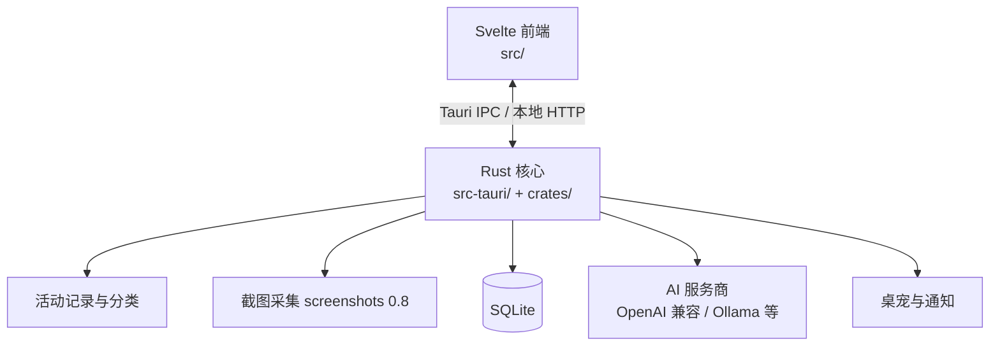
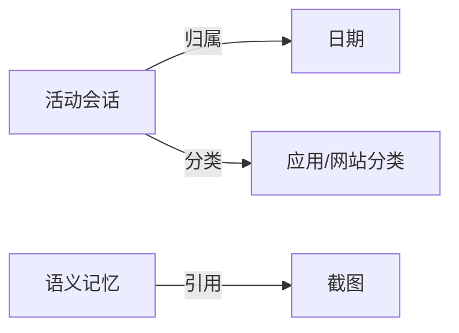

# PROJECTWIKI.md

> 基础版知识库（2026-08-18 创建）。当前以"骨架 + 已知信息"为原则建立，各章节标注待补全项，后续随代码变更增量更新，避免整篇重写。

## 1. 项目概述

- **目标**：Work-Review——自动记录电脑工作活动（应用/网站/截图），生成工作日报与统计，辅以 AI 助手、语义记忆与桌宠通知。
- **背景**：面向个人工作复盘与效率管理，支持 Windows / macOS / Linux。
- **范围**：活动记录与分类、AI 日报/助手、桌宠通知、多语言界面（简中/繁中/英/阿文）。
- **技术栈**：Tauri 2.10（Rust 核心）+ Svelte/Vite/Tailwind 前端 + TypeScript 工具链（Node 22+），数据存 SQLite。
- **运行环境**：桌面端；macOS 需辅助功能/输入监控授权，Windows 涉及 UIA 探测与 Defender 智能控制说明。

## 2. 架构设计

- 关键路径：活动记录 → 分类（内置知识库 + AI 学习）→ 统计/日报 → AI 助手与记忆检索。
- 前端入口 `src/`，Rust 入口 `src-tauri/` 与 `crates/`（workspace），构建产物经 `dist/`。

## 3. 架构决策记录（ADR）

- 目录：`docs/adr/`（待建立；当前以本节条目形式记录）
- **ADR-20260818-01｜RustSec 审计降噪策略**：`cargo audit` 仅对**漏洞与 unsound 类**公告建 Issue 跟踪；unmaintained 类（gtk-rs GTK3、unic-\*、paste、proc-macro-error、fxhash、rustls-pemfile，共 19 条）加入 `security-audit.yml` 的 `ignore`。理由：unmaintained 为信息性提示、无 patched 版本、多数源于 Tauri 2 Linux 依赖树，无法通过升级消除。影响：审计 Issue 信噪比提升；待 Tauri 3 / GTK4 迁移时可重估。验证：下次周一定时审计不再生成该类 Issue。

## 4. 设计决策 & 技术债务

- **screenshots 0.8.10 依赖链**：引入 rand 0.7.3（RUSTSEC-2026-0097）与 0194/0195 两条已知公告；Linux-only 路径不接触用户输入，上游暂无升级版本，待上游修复后 `cargo update`。
- **gtk-rs GTK3（0.18.x）**：Tauri 2 Linux/webkit2gtk 固有依赖，全部 unmaintained；待 Tauri 生态迁移 GTK4 后自然消除。
- **unsound 跟踪清单（Issue #167-#171）**：anyhow 1.0.102、event-listener 5.4.1、glib 0.18.5、memmap2 0.7.1、rand 0.7.3——均无 patched 版本，上游发布修复后应升级消化。
- **npm 侧**：`npm audit --omit=dev` 作为门禁（高危拦截）；构建工具链漏洞仅报告（当前 9 条，含 nanoid GHSA-2v37-7h3g-55p8）。

## 5. 模块文档

| 模块 | 职责 | 备注 |
|---|---|---|
| `src/` | Svelte 前端（界面、设置、助手、桌宠） | 待补全 |
| `src-tauri/` | Tauri 主程序（Rust 核心、IPC、本地 API） | 待补全 |
| `crates/` | Rust workspace 子模块 | 待补全 |
| `scripts/` | 构建/发布脚本（TypeScript） | 待补全 |
| `.github/workflows/` | CI（`ci.yml`）、发布（`release.yml`）、安全审计（`security-audit.yml` 每周一 03:00 UTC + 锁文件变更触发） | `rustsec/audit-check@v2` 仅在 schedule 触发时建 Issue，push/PR 仅出 Check 报告 |

## 6. API 手册

- 本地 HTTP API：`POST /v1/screenshots/capture`（Bearer Token 保护，返回 JPEG Base64，尊重截图隐私开关）——待补全其余端点。
- Tauri IPC 命令清单：待补全。

## 7. 数据模型

- SQLite：活动会话、截图记录、助手会话历史、语义记忆索引等——实体关系图待补全。

## 8. 核心流程

- 记录链路：前台窗口/输入事件 → 活动聚合 → 分类（内置知识库→AI 学习）→ SQLite → 统计/日报/AI 上下文。
- 截图链路：定时/按需采集 → 隐私过滤（标题脱敏）→ 本地存储/可选上传。
- 详细时序图待补全。

## 9. 依赖图谱

- Rust：tauri 2.10.3、screenshots 0.8.10（连带 rand 0.7/getrandom 0.1、gtk 0.18 系）；完整清单见根 `Cargo.lock`（756 个依赖）。
- 前端：Svelte + Vite + Tailwind + TypeScript，见 `package.json` / `package-lock.json`。
- 许可证摘要见 `THIRD_PARTY_NOTICES.md`。

## 10. 维护建议

- **安全审计**：每周一 03:00 UTC 定时 `cargo audit` + `npm audit`；新增 unmaintained 噪音时优先评估是否入 `ignore`，unsound/漏洞必须跟踪。
- **发布**：`release.yml` 要求 tag 与五个版本源及 `origin/main` 一致；缺安装包/便携包/附件即失败。
- 详细运维/监控建议待补全。

## 11. 术语表和缩写

- **RustSec**：Rust 生态安全公告数据库（RUSTSEC-YYYY-NNNN 编号）。
- **unmaintained**：信息性公告，crate 停止维护，无 patched 版本。
- **unsound**：库的健全性缺陷（安全代码可触发未定义行为），非可直接利用漏洞。
- **MADR**：Markdown 格式架构决策记录模板。

## 12. 变更日志

- 参见 [CHANGELOG.md](./CHANGELOG.md)（本节与该文件双向关联；条目按 Keep a Changelog 维护）。
