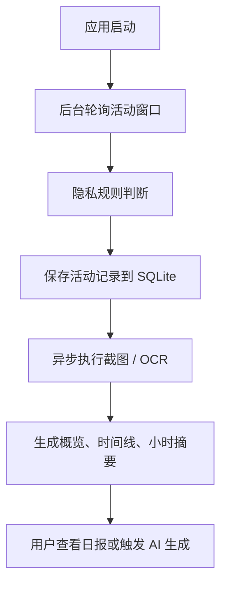

<p align="center">
  
</p>

<h1 align="center">Work Review</h1>

<p align="center">
  <b>自动记录应用、网页与工作轨迹，帮你回顾一天到底做了什么。</b>
</p>

<p align="center">
  <a href="https://github.com/wm94i/Work_Review/releases/latest">
    
  </a>
  
  
</p>

---

## 项目简介

Work Review 是一个基于 `Tauri 2 + Rust + Svelte` 的桌面应用。

它会在后台低干扰地记录：

- 当前正在使用的应用
- 浏览器访问过的网站
- 每段活动持续了多久
- 屏幕截图中的 OCR 文本

然后把这些记录整理成：

- 今日概览
- 时间线回放
- 历史日报
- AI 工作总结

适合写日报、周报、工时回顾、工作留痕与自我复盘。

---

## 当前能力

### 记录与分析

- 自动追踪前台应用使用时长
- 记录浏览器 URL，并按浏览器 / 域名 / 页面聚合
- 时间线查看每日活动轨迹与截图详情
- 概览页查看今日总时长、工作时长、浏览器时长、应用分布
- 支持历史日报查看、切换日期和重新生成
- 到达工作结束时间后自动尝试生成当日日报

### 隐私与控制

- 支持按应用设置 `正常 / 脱敏 / 忽略`
- 支持敏感关键词过滤
- 支持域名黑名单
- 锁屏自动暂停
- 空闲检测自动暂停无效计时
- 支持手动暂停 / 恢复记录

### 设置与维护

- 开机自启动
- 自定义背景图片、透明度和模糊度
- 数据保留天数与存储上限控制
- 清理页面缓存
- 清理历史活动与截图
- 应用内检查更新与自动更新

---

## 页面结构

| 页面 | 说明 |
|------|------|
| 概览 | 查看今日统计、应用使用和网站访问分布 |
| 时间线 | 按时间回看当天活动、截图、窗口标题和小时摘要 |
| 日报 | 查看今天 / 昨天 / 任意历史日期日报，并可重新生成 |
| 设置 | 常规、AI、外观、隐私、存储五类配置 |
| 关于 | 版本信息、更新入口、数据目录、GitHub 链接 |

---

## AI 相关

Work Review 的核心是**本地记录**，AI 只负责把已有活动数据整理成更易读的日报内容。

当前前台提供两种日报模式：

| 模式 | 说明 |
|------|------|
| 基础模板 | 不依赖外部模型，直接生成结构化统计日报 |
| AI 增强 | 调用你配置的文本模型生成更自然的工作总结 |

当前内置的 AI 提供商包括：

- Ollama（本地）
- OpenAI / 兼容 API
- SiliconFlow
- DeepSeek
- 通义千问
- 智谱
- Kimi
- 豆包
- Gemini
- Claude

说明：

- 如果你不启用 AI，核心记录、概览、时间线、历史日报依然可用
- 如果你启用 AI 增强，仅会把用于总结的活动摘要发送到你配置的模型接口

---

## 工作方式



补充说明：

- 默认截图间隔为 `30s`
- 后台轮询间隔为 `5s`
- OCR 有并发限制，避免任务堆积
- 页面侧也有缓存与图片 LRU，防止长时间运行内存无限增长

---

## 平台支持

### macOS

- 支持活动追踪、浏览器 URL、Vision OCR、锁屏检测
- 首次使用需要授予屏幕录制权限
- 可选隐藏 Dock 图标，仅通过托盘访问

### Windows

- 支持活动追踪、浏览器 URL、Windows OCR、锁屏检测
- 默认打包为 `NSIS .exe` 安装包
- 详细说明见 [docs/WINDOWS_OCR.md](docs/WINDOWS_OCR.md)

---

## 下载与安装

从 [Releases](https://github.com/wm94i/Work_Review/releases/latest) 下载最新版本。

| 平台 | 安装包 |
|------|--------|
| macOS Apple Silicon | `.dmg` |
| macOS Intel | `.dmg` |
| Windows | `.exe` |

### macOS 首次打开

如果系统提示“已损坏”或阻止打开，可执行：

```bash
sudo xattr -rd com.apple.quarantine /Applications/Work\ Review.app
```

然后前往：

`系统设置 -> 隐私与安全性 -> 屏幕录制`

为 Work Review 打开权限。

---

## 开发

### 环境要求

- Node.js 18+
- Rust stable
- Tauri 2 开发环境

### 启动开发环境

```bash
npm install
npm run tauri:dev
```

### 构建产物

```bash
npm run tauri:build
```

当前打包目标来自 `src-tauri/tauri.conf.json`：

- macOS: `dmg` / `.app`
- Windows: `nsis`

---

## 项目结构

```text
src/                  前端界面（Svelte）
src/routes/           概览 / 时间线 / 日报 / 设置 / 关于
src/lib/              组件、store、工具函数
src-tauri/src/        Rust 后端、数据库、OCR、隐私、存储、更新逻辑
docs/                 平台与补充文档
```

---

## 隐私与数据

- 所有活动数据默认保存在本地 SQLite
- 截图、OCR 日志和配置保存在本地数据目录
- 支持应用级脱敏、忽略记录和域名过滤
- 可在“关于”页直接打开数据目录
- 可在“存储”设置页控制保留周期和手动清理

---

## 技术栈

| 层级 | 技术 |
|------|------|
| 桌面壳 | Tauri 2 |
| 后端 | Rust |
| 前端 | Svelte 4 + Vite |
| 样式 | Tailwind CSS |
| 数据存储 | SQLite |

---

## 相关文档

- [CHANGELOG.md](CHANGELOG.md)
- [docs/WINDOWS_OCR.md](docs/WINDOWS_OCR.md)

---

## 许可证

MIT License
