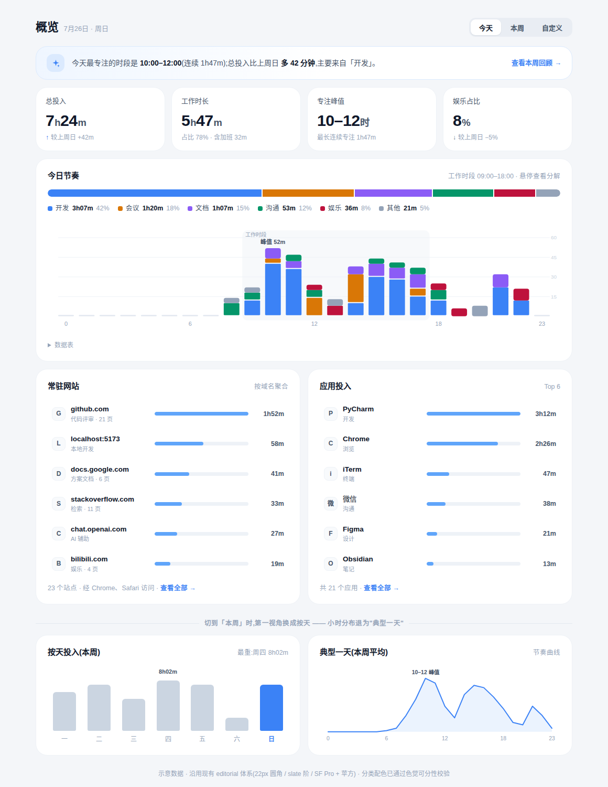

# 概览改版 · 定稿说明

> 状态:**已定稿**。视觉基准见 [`assets/overview-mockup.html`](assets/overview-mockup.html)(可直接浏览器打开,含悬停 tooltip 与数据表兜底),整页效果见下图。本页确立的设计语言总纲见 [`README.md`](README.md)。

改版针对现状 `src/routes/Overview.svelte` 的六个问题动作(现状证据:页头与徽章 L750–757;范围切换独占一张 lead card L773–834;四张无参照系 StatsCard L850–859;网站访问以浏览器为主体 L874 起;应用用量与小时分布左右两张各自为政的图 L927–1035)。逐项说明如下。

## 1. 页头并行

**改了什么**:页面标题、日期(7月26日 · 周日)与「今天 / 本周 / 自定义」分段控制器合并为一行页头;原来独占一整张卡的范围切换区(lead card,L773–834)取消,图标徽章 + 两行副标题的大页头(L750–757)瘦身为一行文字。
**为什么**:范围切换是"上下文",不是"内容",不值得一张 22px 圆角大卡的视觉预算;砍掉这一层后,首屏第一张卡就是洞察条,用户下滚一屏能多看到约 120px 的真实数据。这也成为三个数据页共用的页头范式(标题 + 日期 + 分段控制器 + 至多一个主操作)。

## 2. 洞察条

**改了什么**:页头下新增全宽洞察条:淡蓝渐变底、火花图标、一句话结论("今天最专注的时段是 10:00–12:00…总投入比上周日多 42 分钟,主要来自「开发」"),右侧带一个去向链接(查看本周回顾)。
**为什么**:落实「答案优先于数据」的第一原则——后端夜间合成的 `get_insights` 此前"无处可看"(见 CHANGELOG:*"`get_insights`(夜间合成洞察,此前无处可看)"*),洞察条就是它的家。放在 KPI 之上,是因为它是全页信息密度最高的一句话;做成"条"而不是"卡",是为了与 KPI 卡拉开形态差异,避免被当成第五张 KPI。

## 3. 带参照系的 KPI

**改了什么**:四张 KPI 从「总投入 / 工作时长 / 浏览器 / 应用数」(L850–859,裸数值)换为「总投入(↑较上周日 +42m)/ 工作时长(占比 78% · 含加班)/ 专注峰值(10–12 时 · 最长连续 1h47m)/ 娱乐占比(↓较上周日 −5%)」——每张卡三行:标签、大数值、参照行。
**为什么**:裸数值 "7h24m" 无法回答"这算多还是少";参照行让每个数字自带判断依据。同时把"浏览器时长""应用个数"这类**中间量**换成"专注峰值""娱乐占比"这类**用户真正关心的答案量**——个数与时长仍能在明细双栏看到,不丢信息。

## 4. 今日节奏合卡

**改了什么**:分类构成条(6 色、2px 间隙、带值图例)与 24 小时分类堆叠柱状图合并为一张「今日节奏」主视觉卡:上构成、下分布,共用一套图例;柱图标注工作时段底纹与峰值,悬停出深底 tooltip 分解到分类,卡尾附 `
` 数据表兜底可访问性。
**为什么**:构成与时段本来就是同一个故事的两个切面("做了什么"ד什么时候做"),旧版分居两张卡(L927–1035)且各配一套控件,用户需要自己在脑内做 join。合卡后颜色即索引——构成条某段的颜色,能直接在柱图里找到它出现的钟点。这张卡也是「一个故事一张卡」原则的样板。

## 5. 域名主角双栏

**改了什么**:明细双栏改为「常驻网站(按域名聚合,如 github.com · 1h52m · 代码评审 21 页)× 应用投入(Top 6)」;每行 = 图标 + 名称 + 一句语义副标 + 细进度条(7px)+ 右对齐时长;浏览器(Chrome、Safari)降级为卡尾一行说明文字("23 个站点 · 经 Chrome、Safari 访问")。
**为什么**:旧版以"浏览器"为统计主体(KPI 有浏览器时长、网站访问区按浏览器分组再下钻域名,L858、L874 起),但"Chrome 4h" 不承载任何语义——用户在 Chrome 里做什么才是问题。后端的域名知识库已能把站点分到基础分类(CHANGELOG「内置分类知识库」条目),前端应让域名直接上桌。双栏等宽,呼应"网上的我 × 本地的我"两个并列故事。

## 6. 周模式按天

**改了什么**:切到「本周」时第一视角换为「按天投入」柱状图(周四最重 8h02m,今天高亮主色),小时分布退化为「典型一天(本周平均)」的节奏曲线;mockup 底部以分隔线 + 双卡示意了这一形态。
**为什么**:旧版周模式直接复用小时分布图(把 7 天数据摊到 24 小时轴),回答不了周模式的核心问题——"哪天重、哪天轻、模式健不健康"。差异化后,「本周」有了自己的主视觉;"典型一天"曲线保留了小时视角的价值(平均节奏),但明确降为次级。这一条同时写进总纲成为第 4 原则(周/日模式差异化)。

---

## 落地状态与衔接

- 洞察条依赖 `get_insights` 读通道(后端已就绪,前端接线)。
- KPI 参照系需要"上周同日"一次额外 `get_daily_stats` 调用(接口已有)。
- 「今日节奏」可基于现有 `ActivityHourlyChart` 数据源(`get_hourly_summaries` / 小时聚合)重绘;数据表兜底沿 mockup 的 `
` 结构实现。
- 域名双栏数据即现状"网站访问"接口按域名聚合的结果,浏览器维度仅存于副标文案。
- 时间线、日报两页的探索方案(`timeline.md` / `report.md`)以本页为对齐基准:页头范式、洞察条、六色与图表规范直接复用。
