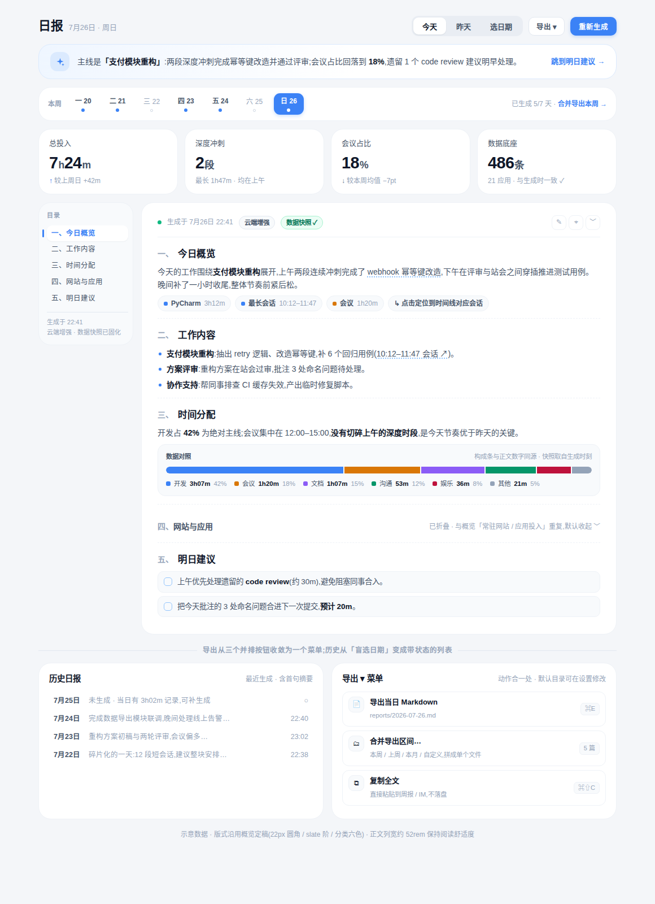

# 日报 · 设计探索

> 状态:**探索方案**(未定稿)。目标形态见 [`assets/report-mockup.html`](assets/report-mockup.html) 与下图;对齐基准见 [`README.md`](README.md) 与 [`overview.md`](overview.md)。
> 现状源码:`src/routes/report/Report.svelte`(1219 行)、`report/reportSections.js`(148 行)、`report/reportMeta.js`(46 行)及 `src/app.css` 的 `report-*` 段。行号均指这些文件。



---

## ① 现状盘点

### 区块结构(Report.svelte)

| 区块 | 内容与交互 | 证据 |
|---|---|---|
| Hero 页头 | 徽章 + 标题(今日日报/历史日报按日期切换)+ 日期行(格式化日期 + AI 模式 chip + 回退原因说明);右侧两行操作:①「今天/昨天/日期选择」胶囊底座 ②导出 Markdown / 批量导出 / 管理段落(条件出现)/ 重新生成(主色) | L577–683;标题切换 L587–589;模式 chip L594;回退说明 L597–601;胶囊底座 app.css L415–435 |
| 提示词设置 | 仅 `ai_mode === 'summary'` 时出现的折叠区,插在页头与正文之间:预设胶片(≤12 个,悬停浮出编辑/删除角标)+ 附加提示词 textarea + 系统提示词覆盖 textarea | L686–781;上限 L225 |
| 昨日回退 | 今天无报告时自动加载昨日,并同时渲染**两条**提示横幅:页级警示横幅 + 文章卡内琥珀横幅,各带"生成今日"按钮 | 逻辑 L151–165;横幅一 L807–834;横幅二 L889–900 |
| 段落目录 | ≥1280px 显示的 sticky 目录,IntersectionObserver 滚动高亮,点击平滑滚动 | L862–884、L520–545;断点 app.css L1772–1792 |
| 文章卡 | 元信息行(绿/琥珀圆点 + 生成时间)→ 实时统计 4 卡(总时长/截图数/应用数/网站数,`get_daily_stats` 并行拉取)→ markdown 正文(marked + DOMPurify),按 `## ` 或 `<details>` 分段渲染 | L901–904;统计 L905–924、L95–98;渲染 L358–361、L925–970 |
| 段落操作 | 悬停浮现:钉选(置顶排序)/隐藏(WR_BLOCK 命名块)/编辑(裸 markdown textarea 弹窗) | L936–966;弹窗 L1031–1070;排序/隐藏 reportSections.js L75–108;序号重排 L110–131 |
| 隐藏块管理 | 有隐藏块时页头多出「管理段落」按钮,展开成正文上方一张恢复卡 | L651–663、L835–861 |
| 空态/骨架 | 生成中骨架屏;无报告空态(✨ 生成按钮) | L974–999、L1000–1025 |
| 批量导出 | 弹窗:本周/上周/本月/上月快捷区间 + 起止日期,合并为单个 md | L1149–1219、L301–311 |

### 关键事实

- **报告与统计双源**:统计 4 卡取实时 `get_daily_stats`(L95–98),正文取生成时刻的落库内容——白天重看昨晚的报告,数字可能已对不上,页面不做任何标注。
- 统计卡顶部 accent 四色为 indigo/emerald/amber/sky(app.css L1918–1935),与分类六色无关;目录高亮、列表 marker 用 indigo 系(L1848–1867、L1869–1872)。
- 正文列宽 52rem 居中(L1902–1905),`markdown-body h1` 2.35rem(L1970–1974)。
- 段落结构靠 AI 输出的 `## ` 标题与 `WR_BLOCK_START` 注释约定(reportSections.js L2–7),块名映射 i18n `report.blockNames.*`。

## ② 问题清单

### 信息架构

| # | 问题 | 依据 |
|---|---|---|
| A1 | **无 TL;DR**:报告是页面里唯一"AI 给出的答案",但页面不提炼它——用户要通读全文才能拿到结论;洞察条(总纲原则 1 的固定容器)缺席。 | 原则 1 违背 |
| A2 | **统计卡是计数不是答案**:截图 486 张、应用 21 个、网站 23 个(L905–924)都是无参照系的中间量,回答不了"今天怎么样";与概览定稿的带 delta KPI 形态脱节。 | 原则 1 违背 |
| A3 | **报告与数据无互证**:正文说"开发为主线",统计卡在三屏之外且口径(实时)与正文(快照)不同;正文数字无法定位到时间线证据;实时/快照差异不提示。 | 原则 2/3 违背 |
| A4 | **设置插在阅读动线中间**:提示词设置区(L686–781)横在页头与正文之间,"读报告"被"配置生成器"打断;它只与"重新生成"动作相关,却常驻版面。 | 原则 3 违背 |
| A5 | **昨日回退双横幅**:同一信息渲染两条横幅、两个"生成今日"按钮(L807–834、L889–900),首屏被警示占据。 | — |
| A6 | **历史动线盲选**:切历史只有日期选择器,不知道哪天有报告、哪天空白,选中空日期才发现要重新生成;批量导出藏在弹窗里与"历史"割裂。 | — |
| A7 | **页头动作过载**:导出/批量导出/管理段落/重新生成最多四钮并排(L628–680),再叠日期三控件——主操作(重新生成)的焦点被稀释(app.css L415 的注释本意即"让重新生成成为唯一主色焦点")。 | — |

### 视觉

| # | 问题 | 依据 |
|---|---|---|
| V1 | 统计卡 accent 四色(indigo/emerald/amber/sky)与分类六色是两套并行色板;目录/marker 的 indigo 与主色蓝 `#3b82f6` 相邻却不相等。 | app.css L1918–1935、L1848–1872 |
| V2 | `markdown-body h1` 2.35rem 远超页题 22px,AI 若输出 `# ` 标题会在卡内出现比页面任何元素都大的字。 | app.css L1970–1974 |
| V3 | 段落编辑是裸 markdown textarea(L1043–1048),与产品其余表单质感断裂;`WR_BLOCK` 注释一旦被用户误删,钉选/隐藏静默失效。 | — |
| V4 | 目录 1280px 以下整体消失(app.css L1772–1792),窄窗口长报告失去导航。 | — |

### 一致性(对齐五原则逐条检查)

| 原则 | 现状表现 | 判定 |
|---|---|---|
| 1 答案优先 | 无 TL;DR;统计卡为裸计数 | ✗(A1、A2) |
| 2 一个故事一张卡 | 文章卡本身成立;但设置区、双横幅、隐藏块管理卡都挤进"读报告"这一个故事 | ✗(A4、A5) |
| 3 层级 | 有明细(正文)无洞察/KPI 层;操作与内容混排 | ✗(A3、A7) |
| 4 周/日差异化 | 只有"日"形态;周仅体现为批量导出区间,无周报视图 | △(边界:周报属后续形态,先留好入口) |
| 5 视觉 token | accent 四色、indigo 系、超大 h1 均偏离 token | ✗(V1、V2) |

## ③ 改版方案

### 信息层级(自上而下)

```
页头        日报 + 日期 ——「今天 / 昨天 / 选日期」分段控制器 + 导出▾(菜单) + 重新生成(唯一主色)
洞察条      报告 TL;DR:"主线是「支付模块重构」…会议占比回落到 18%,遗留 1 个 code review 建议明早处理" → 跳到明日建议
历史周条    本周 7 天 chips(实心点=有报告 / 空点=未生成 / 旋转=生成中),今天高亮;尾部"已生成 5/7 · 合并导出本周"
KPI         与报告同口径的 4 个答案:总投入(+42m)/ 深度冲刺(2 段)/ 会议占比(−7pt)/ 数据底座(486 条 · 与生成时一致 ✓)
正文        目录 × 文章卡:序号章节、证据 chips、数据对照面板、可折叠重复段
互证/出口   段落级数据对照(构成条)、正文数字下划线定位时间线;导出菜单与历史列表
```

### 重点思考一:AI 报告的阅读版式

- **文章卡保持"一个故事"纯度**:提示词设置整体迁出,收进「重新生成」按钮旁的设置抽屉(点击 ▾ 展开预设/附加提示词/系统覆盖)——配置只在要生成时出现(解 A4);隐藏块恢复入口并入同一抽屉;昨日回退只保留文章卡内一条横幅(解 A5)。
- 字阶收敛:章节标题 16.5px/700(与卡题同阶),`h1` 降到页题以下(修 V2);序号沿用现有 CJK 重排(reportSections.js L110–131)但以"编号 + 标题"双色呈现;正文列宽维持 52rem。
- 目录降断点到 ≥1024px,窄窗口折叠为文章卡顶部的横向锚点条(修 V4);目录底部固定显示生成元信息(时间/模式/快照状态),与正文元信息行互为冗余。
- 段落悬停操作(钉选/隐藏/编辑)收进右上 ⋯,编辑弹窗升级为"标题 + 富文本域 + 预览"三段式(修 V3 第一半);`WR_BLOCK` 注释在编辑器中以只读块标签呈现,防误删(修 V3 第二半)。

### 重点思考二:报告与数据的互证

- **快照固化**:`generate_report` 时把当刻统计快照(总时长/构成/会话/Top 应用)随报告落库;页面 KPI 与正文同源,元信息行挂「数据快照 ✓」;当实时数据与快照偏差超阈值(如 ±5min)时 chip 变为「数据已更新,较生成时 +38m · 重新生成」——把 A3 的隐患变成显式状态。
- **KPI 参照系化**(对齐概览定稿):总投入带上周同日 delta;"深度冲刺 2 段 · 最长 1h47m"直接消费 `get_work_sessions`;会议占比对本周均值;"数据底座"保留计数但注明与快照一致性。accent 色统一为六色/主色 token(修 V1)。
- **段落级证据**:①概览段下挂证据 chips(「PyCharm 3h12m」「最长会话 10:12–11:47」…),点击带 `date+hour` 参数跳时间线定位到对应会话(复用 `timeline-focus-date` 事件);②「时间分配」段内置**数据对照面板**:六色构成条 + 图例(细 mark + 2px 间隙规范),与正文百分比并排互证;③正文中的时长/时段数字加蓝点下划线,悬停浮出来源摘要。
- **重复内容降级**:「网站与应用」这类与概览双栏重复的章节默认折叠并标注去处(mockup 第四节),报告聚焦"只有 AI 能写"的叙事。

### 重点思考三:导出 / 历史动线

- **导出收敛为一个菜单**:导出当日 Markdown(显示目标路径)/ 合并导出区间(周/月快捷项,即现批量导出 L1149–1219 的收纳)/ 复制全文(新增,喂周报/IM 的最短路径)。页头从四钮变两钮:「导出 ▾」+「重新生成」(解 A7)。
- **历史从盲选变可见**:历史周条常驻页头下,7 天状态一眼可辨(解 A6);「选日期」打开的历史面板升级为**带首句摘要的列表**(mockup 底部左卡):日期 + 报告首句 + 生成时刻;未生成的日期显示当日数据规模("有 3h02m 记录,可补生成"),让"补生成"有依据。需要后端小接口 `list_report_dates(range) → [{date, has_report, first_line, created_at}]`。
- 周条尾部「合并导出本周」把导出与历史在同一处闭环;未来周报形态(原则 4)从这里生长:周条 → 周视图。

## ④ 落地清单(按工作量升序)

| # | 事项 | 改动面 | 工作量 |
|---|---|---|---|
| 1 | 昨日回退双横幅合一(删 L807–834 页级横幅,保留卡内横幅) | 前端 | ★ |
| 2 | 视觉 token 对齐:统计卡 accent/目录 indigo → 主色与六色;h1 字阶收敛(app.css L1918–1935、L1970–1974) | 前端(纯 CSS) | ★ |
| 3 | 页头动作收敛:导出/批量导出/复制合并为「导出 ▾」菜单;管理段落入口迁生成抽屉 | 前端 | ★★ |
| 4 | 洞察条(TL;DR):首版取正文首段/首个 blockquote 摘要,后续由生成端输出专用 `summary` 字段 | 前端先行,后端增强 | ★★ |
| 5 | KPI 参照系化:上周同日 `get_daily_stats` 对比 + `get_work_sessions` 冲刺段(接口均已有) | 前端 | ★★ |
| 6 | 提示词设置迁入生成抽屉;目录断点降至 1024 + 窄屏锚点条 | 前端 | ★★ |
| 7 | 历史周条 + 历史列表(需 `list_report_dates` 汇总接口,含首句与"当日记录量") | 前端 + 后端(小) | ★★★ |
| 8 | 数据快照固化:`generate_report` 落库 stats snapshot;KPI/对照面板改读快照,偏差提示 | 前端 + 后端 | ★★★ |
| 9 | 段落级互证:证据 chips 与「数据对照」面板;跳时间线定位(依赖时间线方案 #5) | 前端 + 后端(生成端输出结构化引用) | ★★★★ |
| 10 | 正文数字溯源(生成时嵌入活动引用,悬停展示来源) | 前端 + 后端(生成管线改造) | ★★★★★,可后置 |

> 1–6 一个迭代内可完成,构成"阅读版式"改版;7–8 补齐互证地基;9–10 是"报告即证据链"的长线目标。
