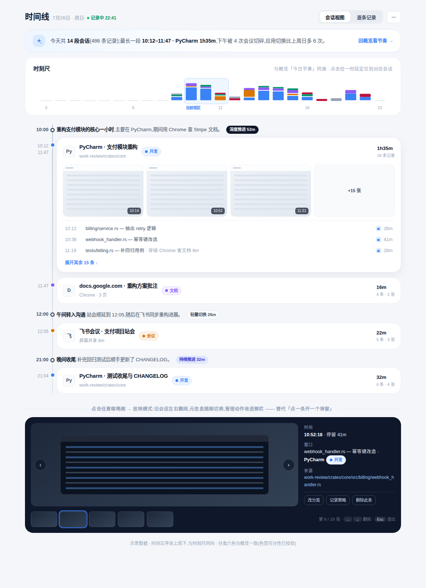

# 时间线 · 设计探索

> 状态:**探索方案**(未定稿)。目标形态见 [`assets/timeline-mockup.html`](assets/timeline-mockup.html) 与下图;对齐基准见 [`README.md`](README.md) 与 [`overview.md`](overview.md)。
> 现状源码:`src/routes/timeline/Timeline.svelte`(2470 行)、`timeline/Summary.svelte`(620 行)、`timeline/timelineData.js`、`timeline/summaryPresentation.js`。行号均指这些文件。



---

## ① 现状盘点

### 区块结构(Timeline.svelte)

| 区块 | 内容与交互 | 证据 |
|---|---|---|
| 页头 | 图标徽章 + 标题/副标;今日模式下显示录制圆点 + 实时时钟(每秒刷新,页面隐藏时暂停) | L1058–1078、L1070–1075、L995–1016 |
| 工具栏 | 日期选择器、清理记录(垃圾桶红钮)、刷新、导出 JSON(导出前询问是否含 OCR) | L1079–1115、L750–783 |
| 摘要条 | 「共 N 条记录 \| 00:00 – 最新记录时刻」+「时段总结」跳转链接(带小时总结数角标) | L1139–1161 |
| 活动流 | 左侧 6rem 锚列(时刻 + 圆点标记)+ 垂直 rail;条目分两档:**特写卡**(缩略图大图 + 应用/分类/时长/标题/URL)与**紧凑行**(图标 + 标题 + 时长) | L1163–1253、rail L1816–1826 |
| 特写遴选 | 启发式打分:时长 ≥20min +3 / ≥10min +1、有 URL +1、应用或分类切换 +1、首条 +1;得分 ≥3 且间隔 ≥2 条才入选,每页最多 4 张 | L534–537、L542–594 |
| 分页 | 每页 12 条(3×4 设计),点「加载更多」追加;实时 `screenshot-taken` 事件按 id/分组键 upsert | L533、L1256–1278、L1024–1042、timelineData.js L20–54 |
| 详情弹窗 | 头部(大图标 + 应用名 + 删除/关闭)→ **应用分类宫格**(改派 + 新建/重命名/删除自定义分类)→ **记录策略**(完整/脱敏/忽略)→ 截图(max-h 96)→ 窗口标题/时间/时长/URL | L1284–1571;分类 L1348–1477;隐私 L1480–1517;截图 L1519–1541 |
| 清理面板 | 按日期 / 时间段 / 应用三种批量删除,z-150 盖在详情弹窗上 | L852–965、L1574–1671 |
| 确认弹层 | 改分类 / 应用新分类 / 删分类 / 隐私规则四种内联确认,z-150 | L1674–1755 |
| 图片管线 | 缩略图(400px)与高清图(1200px)双 LRU 缓存(60/20 条),前 6 条预载高清 | L54–82、L484–531、L633–638 |

### 时段总结(Summary.svelte,独立路由 `/timeline/summary/:date`)

- 从时间线摘要条跳入,返回键回时间线并保留日期(L90–94、Timeline L1146–1160)。
- 逐小时"带":左锚(小时 + 时长)+ 卡(AI 一句话总结拆主句/次句、峰值徽章、节奏 chip、应用标签、展开全文)(L134–198)。
- 节奏 chip 阈值:≥45min 深度推进 / ≥20min 持续推进 / 其余轻量切换(summaryPresentation.js L75–85)。

### 关键事实

- 排序为**最新在前**(timelineData.js L11–18),但摘要条文案写作 "00:00 – 22:41" 的正序区间(L1143)。
- `get_hourly_summaries` 在主加载时已并行拉取(L614–617),却只用来渲染角标数字(L1154–1156),内容本身不在时间线出现。
- 视觉为**琥珀/暖石色系**:特写标记 `#b45309`(L1895–1897)、分类 pill 固定琥珀(L2084–2102)、时长 chip `#9a3412`(L2104–2112)、正文 stone 灰(L1861–1866、L2131–2147);而应用图标底色又取分类色(L347–350)。

## ② 问题清单

### 信息架构

| # | 问题 | 依据 |
|---|---|---|
| A1 | **答案被放逐**:页面对"我今天做了什么"零回答——摘要条只报记录条数与时间跨度(L1141–1144);已生成的小时 AI 总结要跳独立路由才能看(L1146–1160),证据(时间线)与结论(总结)分居两页,无法对照。 | 原则 1 违背 |
| A2 | **故事被切碎**:叙事单元应是"一段会话",现状以 30 秒级原始记录为条目,一段 1.5h 的连续开发被摊成 18 条近似重复的卡;特写遴选(L542–594)靠启发式挑"好看的卡",挑的仍是碎片而非故事。后端已有 `get_work_sessions`(连续专注段,见 CHANGELOG)未被此页使用。 | 原则 2 违背 |
| A3 | **层级缺失**:无洞察、无 KPI、无主视觉,进页即明细;与概览「今日节奏」无任何呼应——概览看到 10 点有个峰,到时间线只能靠"加载更多"翻 12 条一页地逼近 10 点。 | 原则 3 违背 |
| A4 | **扫读方向矛盾**:列表最新在前(倒序),rail 隐喻与摘要条 "00:00–22:41" 都是正序;沿 rail 下移时间却在回退。 | timelineData.js L11–18 vs L1143 |
| A5 | **分页破坏时间连续性**:12 条/页 + 手动加载更多(L533、L1256),一天数百条需十几次点击,且无法按时段跳转。 | — |
| A6 | **详情弹窗被设置劫持**:查看一条记录的弹窗里内嵌了整套分类 CRUD(新建/重命名/删除,L1389–1477)与隐私规则(L1480–1517),再叠内联确认层(z-150,L1674–1755),最深 3 层遮罩;"看截图"这个高频动作与"管理分类"这个低频动作抢同一空间。 | — |
| A7 | **截图动线一次一枪**:缩略图只在特写卡出现,紧凑行无视觉证据;点开详情看完一张必须关闭再点下一条,无法沿时间连续翻阅。 | L1222–1249、L1284 起 |

### 视觉

| # | 问题 | 依据 |
|---|---|---|
| V1 | 琥珀/暖石色系与定稿 slate/蓝体系冲突,同产品呈现"两套 App"。 | L1895–1897、L2084–2112 vs token 表 |
| V2 | 分类信息双轨制:pill 永远琥珀(不随分类变色,L2084–2102),图标底色却取分类色(L347–350)——同一张卡上两种分类编码打架,六色 token 未被使用。 | — |
| V3 | 特写/紧凑两档卡片由算法决定而非信息决定,视觉节奏不可预期;特写卡阴影与纹理(board 斜纹底,L1796–1808)重于概览基准。 | L542–594 |
| V4 | 圆角 1.35rem(21.6px)卡嵌在 26px 的 `page-card` 里,与 22px token 三值并存。 | L1899–1902、app.css L558 |

### 一致性(对齐五原则逐条检查)

| 原则 | 现状表现 | 判定 |
|---|---|---|
| 1 答案优先 | 无洞察条;摘要条只有计数;AI 总结在别页 | ✗(A1) |
| 2 一个故事一张卡 | 原始记录一条一卡;会话概念缺席 | ✗(A2) |
| 3 层级 | 进页即明细,无洞察/KPI/主视觉层 | ✗(A3) |
| 4 周/日差异化 | 天生日页面,不需周模式;但缺少回概览周视角的引流 | △(边界内,补链接即可) |
| 5 视觉 token | 琥珀色系、pill 不随分类、圆角混用 | ✗(V1–V4) |

## ③ 改版方案

### 信息层级(自上而下)

```
页头        时间线 + 日期 + 记录中状态 ——「会话视图 / 逐条记录」分段控制器 + ⋯(导出/清理收纳)
洞察条      "今天共 14 段会话(486 条),最长 10:12–11:47 · PyCharm 1h35m,下午被 4 次会议切碎…" → 回概览看节奏
时刻尺      24h 分类堆叠缩览(与概览「今日节奏」同一图形),高亮当前视区,点击任一时段定位
会话流      小时叙事带(原时段总结并入) + 会话卡(特写:胶片 + 成员行;紧凑:单行) —— 主视觉即明细
放映模式    点缩略图进入:大图 + 元信息侧栏 + 会话胶片条,← → 连续翻阅(全屏沉浸态,不套层级)
```

### 重点思考一:活动流的扫读性

- **时间正序**(早 → 晚)自上而下,与时刻尺、rail 隐喻同向(解 A4);「逐条记录」视图保留倒序开关给"刚才在干嘛"场景。
- 流内的一级节点从"记录"升为**小时叙事带 + 会话卡**:小时带给结论(AI 一句话 + 节奏 chip + 该小时时长),会话卡给证据。扫一列小时带 ≈ 读完一天,想核查再看卡。
- 分类色系统性上岗:会话标记点、分类 chip、时刻尺堆叠段同用六色(解 V2);节奏 chip 沿 Summary 现有三档(深/稳/轻,summaryPresentation.js L75–85)但改用 slate/靛蓝 token。
- 取消"加载更多"按钮式分页:按小时懒加载 + 时刻尺跳转(解 A5),滚动位置与时刻尺高亮双向同步。

### 重点思考二:会话分组视角

- **会话 = 同应用(或同域名)且间隔 ≤5min 的连续记录段**,与后端 `get_work_sessions` 口径对齐;每段会话一张卡(落实原则 2):头部 = 图标 + 「应用 · 语义标题」 + 分类 chip + 起止/总时长/记录数。
- 特写与紧凑不再由打分启发式决定(替换 L542–594),改为**确定性规则**:时长 ≥20min 或含 ≥3 张截图的会话展开为特写(胶片 + 前 3 条成员行 + 展开其余);短会话一律紧凑单行。视觉节奏因此可预期。
- 成员行保留原始记录粒度(时刻 + 标题 + 时长 + 截图数),"逐条记录"视图 = 全部会话展开,一条不丢。
- 跨会话穿插(如开发中切出去查文档 6m)以成员行内联备注呈现,不打断会话卡(见 mockup 11:19 行)。

### 重点思考三:截图查看动线

- 特写会话卡内置**胶片区**(≤3 张缩略图 + "+N 张"),紧凑行在时长旁标注截图数——证据密度先于点击可见(解 A7 前半)。
- 点任意缩略图进入**放映模式**(替代详情弹窗):左右键/按钮沿会话连续翻阅,底部胶片条定位,右栏元信息(时刻、停留、窗口标题、分类、来源 URL)随图切换;`Esc` 退出。现有双 LRU + 前 6 张高清预载管线(L484–531)直接复用为翻阅预取。
- **管理动作降位**:改分类/记录策略/删除此条收进放映模式侧栏的次级按钮组(见 mockup),分类的新建/重命名/删除整体迁往设置页——详情场景只保留"改派到已有分类"一步操作,弹窗层数从 3 层降到 1 层(解 A6)。

### 重点思考四:与概览「今日节奏」的呼应

- 页首**时刻尺**与概览主视觉共用同一图形语言(细列 30px、2px 段隙、六色、悬停 tooltip),用户在两页间切换时靠同一张"地图"定位。
- 双向动线:概览柱图点击某小时 → 跳时间线并滚动到该小时(现有 `timeline-focus-date` 事件 L991–992 扩展 `hour` 参数);时间线洞察条右侧"回概览看节奏"回流。
- 时段总结独立页(Summary.svelte)退役,内容以小时叙事带形式并入流内(数据 `get_hourly_summaries` 本来就已在 loadTimeline 并行拉取,L614–617);原路由 302 到 `/timeline?date=…`。

## ④ 落地清单(按工作量升序)

| # | 事项 | 改动面 | 工作量 |
|---|---|---|---|
| 1 | 视觉 token 对齐:琥珀 → slate/六色,分类 chip 随分类着色,圆角统一 22px(替换 Timeline.svelte `<style>` L1757–2469 与 Summary 同源样式) | 前端(纯 CSS) | ★ |
| 2 | 时间正序 + 倒序开关(timelineData.js 排序 L11–18 参数化;摘要条文案随向) | 前端 | ★ |
| 3 | 洞察条接入(复用概览洞察条组件;数据 `get_insights` 已就绪 + 会话统计一句话) | 前端为主,后端零改动 | ★★ |
| 4 | 小时叙事带并入流(消费已拉取的 hourlySummaries;Summary 路由退役重定向) | 前端 | ★★ |
| 5 | 时刻尺 + 点击/滚动双向定位(数据由现有活动聚合;概览 `timeline-focus-date` 扩展 hour 参数) | 前端,后端零改动 | ★★ |
| 6 | 详情瘦身:分类 CRUD 迁设置页,详情/放映侧栏只留改派 + 记录策略 + 删除 | 前端(设置页新增分类管理段) | ★★ |
| 7 | 放映模式(lightbox):键盘导航、胶片条、预取(复用 LRU 管线 L484–531) | 前端 | ★★★ |
| 8 | 会话分组:`get_timeline` 返回增加 session 维度(或前端按 gap≤5min 聚合先行、后端 `get_work_sessions` 对齐口径收尾);特写启发式(L542–594)删除 | 前端 + 后端 | ★★★ |
| 9 | 按小时懒加载替换 offset 分页(`get_timeline` 支持 hour 游标;实时 upsert 逻辑 L1024–1042 适配会话分组) | 前端 + 后端 | ★★★★ |

> 1–5 可独立发布为"视觉与叙事层"改版;6–7 是交互质变;8–9 触后端,建议随 `get_work_sessions` 口径统一排期。
